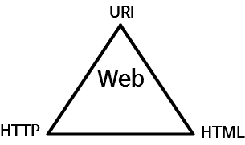

# 210828_TIL

## 웹 (Web)

- **웹(Web)** 은 전 세계에 흩어져 있는 정보 자원을 연결하는 **네트워크(World Wide Web)**
- 웹의 3대 요소 : 웹을 통해 정보 자원에 접근하여 이용할  수 있는 것

- **URI** : 정보자원의 위치를 표시하기 위한 표기법
- **HTTP** : 위치 표시가 있는 정보자원에 접근하기 위한 통신 규약
- **HTML** : 정보자원과 정보자원 사이를 오가기 위한 하이퍼텍스트

 

## HTML 개요

#### 1. HTML과 웹 브라우저
- HTML과 웹 브라우저는 뗄 수 없는 관계
- HTML 파일을 실행하는 곳 ⇒ 웹 브라우저

#### 2. HTML
- **Hyper Text Markup Language**
- 제목, 단락, 목록 등과 같은 본문을 위한 구조적 의미 + 링크, 인용과 그 밖의 항목으로 구조적 문서를 만들 수 있는 방법 제공
- 웹 문서를 이루고 있는 하나, 하나를 HyperText라고 함
- markup : 데이터를 그 자체로 어디에, 어떻게 표현할 지 표현하는 기술

 

## HTML, CSS 그리고 JavaScript

**[구조]** HTML : 웹 문서의 기본적인 골격을 담당
**[표현]** CSS : 각 요소들의 레이아웃, 스타일링을 담당
**[동작]** JavaScript : 동적인 요소(사용자와의 인터랙션)을 담당

 

## 웹 표준, 웹 접근성, 웹 호환성

- 웹 표준 (Web Standards)
    - HTML5는 W3C에서 2014년에 공식 표준화
    - 2019년에 WHATWG(애플, 모질라, 구글, MS)에 의해 HTML Living Standard가 표준화 됨
    - HTML이 표준화 되기 이전에는, 익스플로러의 액티브x처럼 독자적인 플러그인이 존재하기도 하였음
    - 웹 표준을 준수하여 작성한다면 운영체제, 브라우저마다 의도된 대로 보여지는 웹 페이지를 만들 수 있음
    - _같은 요소를 같은 형식으로 보여지기위한 브라우저들끼리의 약속_ 이라고 이해하면 쉬움!
    - 
- 웹 접근성 (Web Accessibility)
    - 웹 접근성은 장애를 가진 사람과 장애를 가지지 않은 사람 모두가 웹사이트를 이용할 수 있게 하는 방식
    사이트가 올바르게 설계되어 개발되고 편집되어 있을 때 모든 사용자들은 정보와 기능에 동등하게 접근할 수 있다.
    - 또한 웹 접근성은 장애를 갖지 않은 사람에게도 이점을 준다.
        - 작은 화면, 다른 입력 모드 등을 가진 휴대폰, 스마트 워치, 스마트  TV 및 다른 디바이스를 사용하는 사람
        - 나이가 들어감에 따라 기능적 능력이 변한 연로한 사람
        - 팔이 부러지거나 안경을 잃어버려서 "일시적인 장애"를 겪는 사람
        - 밝은 햇빛이나 소리를 듣기 힘든 환경에 있어 "상황적 제약"을 겪는 사람
        - 느린 인터넷을 사용하거나 제한적이거나 비싼 대역폭을 사용하는 사람
    - 웹 브라우징에 쓰이는 보조과학기술 : 스크린리더, 화면 돋보기, 음성 인식, 키보드 오버레이 등
    - 음성 인식, 가상 키보드 등이 있는 사이트라면 웹 접근성이 잘 되어있는 브라우저라고 보면 됨!

- 웹 호환성 (Cross Browsing)
    - 웹 브라우저 버전, 종류와 관계 없는 웹 사이트 접근
    - 웹 표준 준수를 통한 브라우저 호환성 확보
        - HTML, CSS 문법 준수
        - 동작, 레이아웃, 플러그인 호환성

