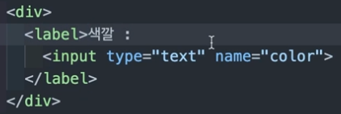
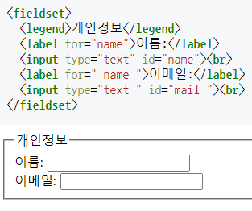

## 폼 관련 요소

### `<form>` 이란?
- 정보를 제출하기 위해 입력 양식 전체를 감싸는 태그
- 텍스트, 버튼, 라디오 등 컨트롤 요소(control element)로 구성
- 입력된 데이터를 한 번에 서버로 전송하며, 전송한 데이터는 웹 서버가 처리하고, 결과에 따른 또 다른 웹 페이지를 보여준다.
- 폼 태그 동작 방법
    1. 폼 내용을 입력한 후 모든 데이터를 웹 서버로 보낸다
    2. 웹 서버는 받은 폼 데이터를 처리하기 위해 웹 프로그램으로 넘긴다.
    3. 웹 프로그램은 폼 데이터를 처리하고 처리 결과에 따른 새로운 html 페이지를 웹 서버에 보낸다.
    4. 웹 서버는 받은 html 페이지를 브라우저에 보낸다.
    5. 브라우저는 받은 html 페이지를 보여준다.

```html
<form action="" method="get" class="form-example">
  <div class="form-example">
    <label for="name">Enter your name: </label>
    <input type="text" name="name" id="name" required>
  </div>
  <div class="form-example">
    <label for="email">Enter your email: </label>
    <input type="email" name="email" id="email" required>
  </div>
  <div class="form-example">
    <input type="submit" value="Subscribe!">
  </div>
</form>
```

<br>

### `<form>` 속성
- **action**
    - 폼(데이터)을 전송할 서버 쪽 스크립트 파일을 지정
    - 데이터를 보내려면 브라우저가 전송 위치(URL)를 알아야 하기 때문에 이를 위해 action 속성을 사용
- **method**
    - 폼을 서버에 전송할 http 메소드를 정함
    - GET : 데이터를 요청 본문으로 전송
    - POST : 데이터를 `action` URL과 `?` 구분자 뒤에 이어 붙여서 전송
- **label**
    - 사용자 인터페이스(UI) 요소의 라벨(label)을 정의할 때 사용
    - for 속성 : 해당 속성을 사용하면 다른 요소와 결합할 수 있으며, 이때 `<label>` 요소의 `for` 속성값은 결합하고자 하는 요소의 id 속성값과 같아야 한다.
    - `<label>` 속성 안에 `<input>` 요소가 있다면 for 속성을 명시하지 않아도 결합된다.
    
- **input**
    - 사용자가 정보를 입력할 수 있는 칸
- **fieldset**
    - `<form>` 요소에서 연관된 요소들을 하나의 그룹으로 묶을 때 사용
- **legend**
    - 필드셋에 제목을 달아주는 태그
    
- **name**
    - 폼을 식별하기 위한 이름을 지정
- **accept-charset**
    - 폼 전송에 사용할 문자 인코딩을 지정
- **target**
    - action에서 지정한 스크립트 파일을 현재 창이 아닌 다른 위치에 열도록 지정

<br>

### `<input>`
```html
<input type="유형" id="id값" name="name값" value="banana" [속성="속성값"]>
```

- **type** : input 태그를 입력할 때 필수적인 속성
- **id** : 필수는 아니지만 꼭 값을 넣도록 요구되는 속성 값 (다른 input 태그와 구별하기 위함과 웹 서버에서 입력 값을 판별하기 위함)
- **name** : 서버로 전달되는 이름
- **value** : 입력 태그의 초기값
- **placeholder** : 입력 필드에 사용자가 적절한 값을 입력할 수 있도록 도와주는 짧은 도움말
- **autocomplete** : 자동 완성 기능을 사용할지 여부를 명시
    - on으로 명시하면, 브라우저는 사용자가 이전에 입력했던 값들을 기반으로 사용자가 입력한 값과 비슷한 값들을 드롭다운 옵션으로 보여준다.
- **required** : 폼 데이터(form data)가 서버로 제출되기 전 반드시 채워져 있어야 하는 입력 필드를 명시
    - checkbox, date, email, file, number, password, pickers, radio, search, tel, text, url 속성에서는 제대로 동작함
- **disabled** : 해당 <input> 요소가 비활성화됨을 명시
    - disabled 속성이 명시된 <input> 요소는 사용할 수 없으며, 사용자가 클릭할 수도 없다. 또한, 폼 데이터가 제출될 때도 disabled 속성이 명시된 <input> 요소의 데이터는 제출되지 않는다.
- **readonly** : 입력 필드가 읽기 전용임을 명시
    - 사용자가 수정할 수는 없지만, 해당 내용을 하이라이트하거나 복사할 수는 있다.
    - disabled 속성이 명시된 입력 필드의 값은 서버로 제출되지 않지만, readonly 속성이 명시된 입력 필드의 값은 서버로 제출된다.
- **step** : 요소에 입력할 수 있는 숫자들 사이의 간격을 명시
- **min** : 최솟값을 명시
- **max** : 최댓값을 명시

<br>

### `<button>`
- 클릭할 수 있는 버튼을 정의할 때 사용
- `<button>` 요소 안에는 텍스트나 이미지와 같은 콘텐츠를 삽입할 수 있지만, <input> 요소를 사용한 버튼에는 이와 같은 콘텐츠를 삽입할 수 없다. 브라우저별로 <button> 요소에 대해 서로 다른 기본 타입을 사용할 수 있으므로, <button> 요소에는 언제나 type 속성값을 명시하는 것이 좋다.

    ```html
    <button type="button">
    ```
    위와 같이 명시하지 않으면 기본값은 submit이 된다.

<br>
	    
### `<button>` 속성값
- **type="submit"** : 폼의 전송 기능을 담당한다. 사용자의 입력을 서버로 전송하기 위한 버튼
- **type="reset"** : 폼 작성 내용을 초기화하는데 사용한다.
- **type="button"** : 흔히 자바스크립트를 이용한 기능 구현에 많이 사용한다.

<br>
	    
### `<select>`
- 옵션 메뉴를 제공하는 컨트롤
- 콤보박스라고도 하며 Pull-Down Menus라고 표현하기도 한다.
- 방문자로 하여금 손쉽게 원하는 값을 선택할 수 있는 입력폼을 제공
- 속성
    1. size : 드롭다운 목록의 크기를 지정
    2. multiple : 드롭다운 목록의 경우 옵션 중에서 한 개를 선택하는 것이 기본값이다. 하지만 multiple속성에서 숫자를 지정하면 여러 개의 옵션을 선택할 수 있다. 

<br>
	    
### `<option>`
- `<select>` 태그 안에 `<option>`태그를 사용하여 원하는 항목들을 추가
- `<option>`태그는 value속성을 이용해 서버로 넘겨주기 위한 값을 지정해야 한다.
- 속성
    1. value : 옵션을 선택했을 때 서버로 넘겨질 값
    2. selected : 화면에 표시될 때 기본으로 선택되어 있는 옵션 지정

<br>
	    
### `<optgroup>`
- 드롭다운 목록에서 여러 항목들을 몇 가지 그룹으로 묶어야 할 경우 사용
- `<optgroup>`태그를 사용할 때 label속성을 사용해서 그룹의 제목을 붙여준다.
```html
<select>
	<optgroup label="공과대학">
		<option value="archi">건축공학과</option>
	</optgroup>               
</select>
-> 이렇게 optgroup으로 묶으면 공과대학 안의 건축공학과가 있다는 것을 표시해주는 역할을 한다.
		(공과대학 선택불가능해짐)
```

<br>
	    
### `<datalist>`
- 텍스트 필드에 입력할 수 있는 값들을 목록 형태로 제시해 주어 손쉽게 값을 선택할 수 있도록 한다.
- 즉, 텍스트 필드에 값을 직접 입력하는 것이 아니라, 제시한 값 중에서 선택하면 그 값이 자동으로 입력
- 데이터 목록은 텍스트 필드와 함께 사용하기 때문에 `<input>`태그를 같이 사용한다. **`<input>`태그의 list속성 값과 데이터 목록의 id를 같게 만들면 된다.**
```html
<input type="txt"  list="데이터 목록id">
	<datalist id="데이터 목록 id">
		<option> ... </option>
		...
	</datalist>
```

	    <br>
	    
### `<textarea>`

- 한 줄 이상의 문장을 입력할 때 사용(게시판에서 게시물을 입력하거나 회원가입 양식에서 사용자 약관을 표시할 때 자주 사용함)
- 속성
    1. name : 텍스트 영역의 이름을 지정
    2. cols   : 텍스트 영역의 가로 너비를 문자 단위로 지정
    3. rows  : 텍스트 영역의 세로 길이를 줄 단위로 지정합니다 지정한 숫자보다 줄 개수가 많아지면 스크롤 막대가 생긴다.
```html
<textarea 속성="속성" > 내용 </textarea>

<textarea cols="50" row="5" >하고싶은말 </textarea>
```

<br>
	    
## 전역 속성
- `class`
    - 여러 개의 요소에 같은 클래스 명을 부여할 수 있음
    - 대소문자를 구분하지 않음
    - 클래스와 클래스 사이에 공백 사용 가능

	```html
	<input type="text" class="a b">
	```
- `id`
    - 문서 전체에서 유일한 고유식별자(id)를 정의
    - 요소를 가리키거나 스크립트 및 스타일 적용 시 특정 요소를 식별하기 위함
    - 공백이 들어가면 안 됨
    - 무조건 영문자로 시작해야 함
- `style`
    - 요소에 적용할 CSS 스타일 선언을 담는다.
    - 아래와 같이 인라인으로 선언하는 방식은 좋은 방법이 아님

    ```html
    <div style="color: red;"></div>
    ```
- `title`
    - 요소와 관련된 추가 정보를 제공하는 텍스트
- `lang`
    - 요소 내의 수정 불가한 텍스트의 언어와 수정 가능한 텍스트가 사용해야 하는 언어를 정의
    - 기본 값은 "알 수 없음" 으로 정확한 값을 정의하는 게 좋다.
- `data`
    - data-* 로 사용함
    - 속성의 이름을 정할 수 있음

    ```html
    <article
    	id="fruit"
    	data-name="banana"
    	data-color="yellow">
    	...
    </article>
    ```
- `draggable`
    - 드래그 가능 여부를 나타내는 열거형 특성
    - true : 요소 드래그 가능
    - false : 요소 드래그 불가능
- `hidden`
    - 요소가 아직, 또는 더 이상 관련이 없음을 나타내는 불리언 특성
