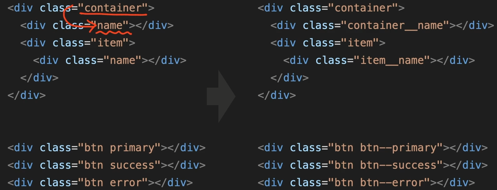

# 복습

<br>

# 오픈 그래프(The Open Graph protocol) 
- 웹페이지가 소셜 미디어(페이스북 등)로 공유될 때 우선적으로 활용되는 정보를 지정하는 것

```html
<meta property="og:type" content="website" />
<meta property="og:site_name" content="Starbucks" />
<meta property="og:title" content="Starbucks Coffee Korea" />
<meta property="og:description" content="스타벅스는 세계에서 가장 큰 다국적 커피 전문점으로, 64개국에서 총 23,187개의 매점을 운영하고 있습니다." />
<meta property="og:image" content="./images/starbucks_seo.jpg" />
<meta property="og:url" content="https://starbucks.co.kr" />

✔ og는 오픈 그래프의 약자
```

- `og:type`: 페이지의 유형(E.g, `website`, `video.movie`)
- `og:site_name`: 속한 사이트의 이름
- `og:title`: 페이지의 이름(제목)
- `og:description`: 페이지의 간단한 설명
- `og:image`: 페이지의 대표 이미지 주소(URL)
- `og:url`: 페이지 주소(URL)

<br>

# 트위터 카드(Twitter Cards)
- 웹페이지가 소셜 미디어(트위터)로 공유될 때 우선적으로 활용되는 정보를 지정

```html
<meta property="twitter:card" content="summary" />
<meta property="twitter:site" content="Starbucks" />
<meta property="twitter:title" content="Starbucks Coffee Korea" />
<meta property="twitter:description" content="스타벅스는 세계에서 가장 큰 다국적 커피 전문점으로, 64개국에서 총 23,187개의 매점을 운영하고 있습니다." />
<meta property="twitter:image" content="./images/starbucks_seo.jpg" />
<meta property="twitter:url" content="https://starbucks.co.kr" />
```

- `twitter:card`: 페이지(카드)의 유형(E.g. `summary`, `player`)
- `twitter:site`: 속한 사이트의 이름
- `twitter:title`: 페이지의 이름(제목)
- `twitter:description`: 페이지의 간단한 설명
- `twitter:image`: 페이지의 대표 이미지 주소(URL)
- `twitter:url`: 페이지 주소(URL)

<br>

# BEM (Block Element Modifier)
- HTML 클래스 속성의 작명법

- `요소__일부분` : Underscore(Lodash) 기호로 요소의 일부분을 표시
- `요소--상태` : Hyphen(Dash) 기호로 요소의 상태를 표시



<br>

# 블록 레벨(Block level) 요소와 인라인(Inline) 요소
`블록 요소`
1.  div, h1, p
2.  사용 가능한 최대 가로 너비를 사용함
3.  크기를 지정할 수 있음
4.  width: 100%, height: 0; 로 시작
5.  수직으로 쌓임
6.  margin, padding 위, 아래, 좌, 우 사용 가능
7.  레이아웃을 잡는 용도

`인라인 요소`
1.  span, img
2.  필요한 만큼의 너비를 사용함
3.  크기를 지정할 수 없음
4.  width: 0, height: 0; 로 시작
5.  수평으로 쌓임
6.  margin, padding 위, 아래는 사용할 수 없음
7.  텍스트를 다루는 용도

<br>

# 태그(Tag)
1. <head> : 문서의 정보
- <title> : HTML 문서의 제목
- <meta> : 기타 정보
   > charset="UTF-8"(조합형 ex.ㅇㅣㄹㅕㅇㅜㅓㄴ) or "EUC-KR"(완성형 ex.이려원)
   > content
   > http-equiv
   > name
   ex)
   <meta name="author" content="이려원">
   <meta name="description" content="이려원의 사이트">
- 스타일 직접 입력
- 스타일 외부에서 가져와서 연결
2. <body> : 문서의 구조

