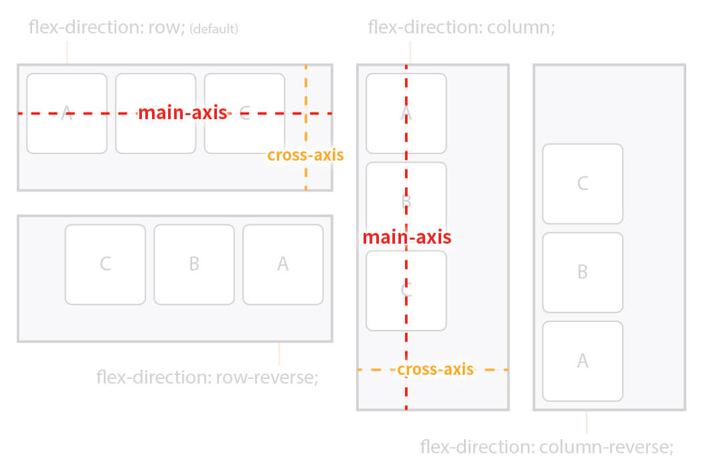
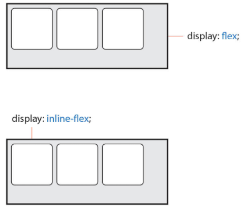

# flex(정렬)

Flex는 2개의 개념으로 나누어 지는데, 첫 번째는 Container 두 번째는 Items 이다. 

주의할 부분은 Container와 Items에 적용하는 속성이 구분되어 있다. 

Container란 Items를 감싸는 부모 요소이며, 각 Item을 정렬하기 위해선 **Container가 필수**이다.

- **Container** :  **`display`**, **`flex-flow`**, **`justify-content`** 등의 속성
- **Items** : **`order`**, **`flex`**, **`align-self`** 등의 속성

<br> 

### 주 축(main-axis)과 교차 축(cross-axis)

값 `row`는 Items를 수평축으로 표시하므로 이때는 주 축이 수평이며 교차 축은 수직이다.

반대로 값 `column`은 Items를 수직축으로 표시하므로 주 축은 수직이며 교차 축은 수평이다.

즉, 방향(수평, 수직)에 따라 주 축과 교차 축이 달라진다.



<br>

### 시작점(flex-start)과 끝점(flex-end)

주 축이나 교차 축의 시작하는 지점과 끝나는 지점을 지칭한다.

방향에 따라 시작점과 끝점이 달라진다.

<br>

### Flex Container 속성

- **display** : Flex **Container의 화면 출력(보여짐) 특성** 정의
    - **flex** : 블록 요소와 같이 Flex Container 정의 (**수직** 쌓임)
    - **inline-flex** : 인라인 요소와 같이 Flex Container 정의 (**수평** 쌓임)



- **flex-flow**: Flex Item의 주 축(main-axis)를 설정하는 `flex-direction`과 Items의 여러 줄 묶음(줄 바꿈)도 설정하는 `flex-wrap`의 단축 속성


    ```css
    flex-flow: 주축 여러줄묶음;

    .flex-container {
    	flex-flow: row-reverse wrap;
    }
    ```
    
- **flex-direction** : Flex **Items의 주 축(main-axis)**을 설정
    - **row**(기본값) : 행 축 (좌 ⇒ 우) (수평)
    - **row-reverse** : 행 축 (우 ⇒ 좌) (수평)
    - **column** : 열 축 (위 ⇒ 아래) (수직)
    - **column-reverse** : 열 축 (아래 ⇒ 위) (수직)
- **flex-wrap** : Flex **Items의 여러 줄 묶음(줄 바꿈)을 설정**
    - **nowrap**(기본값) : 모든 Items를 여러 줄로 묶지 않음(한 줄에 표시)
    - **wrap** : Items를 여러 줄로 묶음
    - **wrap-reverse** : Items를 wrap의 반대 방향으로 묶음
- **justify-content** : 주 **축(main-axis)의 정렬** 방법을 설정 (**수평**)
    - **flex-start**(기본값) : Flex Items를 시작점으로 정렬
    - **flex-end** : Flex Items를 끝점으로 정렬
    - **center** : Flex Items를 가운데 정렬
    - **space-between** : 각 Flex Item 사이를 균등하게 정렬
    - **space-around** 각 Flex Item의 외부 여백을 포함하여 균등하게 정렬
- **align-content** : 교차 축(cross-axis)의 여러 줄 정렬 방법 (수직) * 2줄 이상이어야 동작함
    
    - 주의할 점은 `flex-wrap` 속성을 통해 Items가 여러 줄(2줄 이상)이고 여백이 있을 경우만 사용할 수 있다. 한 줄일 경우 `align-items`를 사용한다.
    - **stretch**(기본 값) : Container의 교차 축을 채우기 위해 Items를 늘림
    - **flex-start** : Flex Items를 시작점으로 정렬
    - **flex-end** : Flex Items를 끝점으로 정렬
    - **center** : Flex Items를 가운데 정렬
    - **space-between** : 시작 ITem은 시작점에, 마지막 Item은 끝점에 정렬되고 나머지 Items는 사이에 고르게 정렬됨
    - **space-around** 각 Flex Item의 외부 여백을 균등하게 정렬
- **align-items** : 교차 축(cross-axis)의 한 줄 정렬 방법
    - 주의할 점은 Items가 `flex-wrap`을 통해 여러 줄(2줄 이상)일 경우에는 `align-content` 속성이 우선이기 때문에 `align-items` 를 사용하려면 `align-content` 속성을 기본값(`stretch`)으로 설정해야 한다.
    - **stretch**(기본 값) : Container의 교차 축을 채우기 위해 Items를 늘림
    - **flex-start** : Items를 각 줄의 시작점(flex-start)으로 정렬
    - **flex-end** : Items를 각 줄의 끝점(flex-end)으로 정렬
    - **center** : Items를 각 줄의 가운데 정렬
    - **baseline** : Items를 각 줄의 문자 기준선에 정렬

<br>

### Flex Items 속성

- **order** : Flex Item의 순서를 설정

  - Item에 숫자를 지정하고 숫자가 클수록 순서가 밀리며, 음수가 허용됨
    - **0**(기본값) : 순서 없음
    - 숫자 : 숫자가 작을 수록 먼저 (음수도 가능)

- **flex**  : flex-grow(증가), flex-shrink(감소), flex-basis(기본)의 단축 속성
  ```css
  flex: 증가너비 감소너비 기본너비;
  ```

  ```css
  .item {
    flex: 1 1 20px;  /* 증가너비 감소너비 기본너비 */
    flex: 1 1;  /* 증가너비 감소너비 */
    flex: 1 20px;  /* 증가너비 기본너비 (단위를 사용하면 flex-basis가 적용) */
  }
  ```

- **flex-grow**  : Flex Item의 증가 너비 비율을 설정
  - 숫자가 크면 더 많은 너비를 가진다. Item이 가변 너비가 아니거나, 값이 0일 경우 효과가 없다.
  - **0**(기본값) : 증가 비율 없음
  - 숫자 : 증가 비율
- **flex-shrink** : Flex Item의 감소 너비 비율을 설정
  - 숫자가 크면 더 많은 너비가 감소한다.
  - Item이 가변 너비가 아니거나, 값이 0일 경우 효과가 없다.
  - **1**(기본값) : Flex Container 너비에 따라 감소 비율 적용
  - 숫자 : 감소 비율

- **flex-basis** : Flex Item의 공간 배분 전 기본 너비 설정
  - 값이 `auto`일 경우 `width`, `height` 등의 속성으로 Item의 너비를 설정할 수 있다. 하지만 단위 값이 주어질 경우 설정할 수 없다.
  - **auto**(기본값) : 요소의 Content 너비
  - 단위 : px, em, rem 등 단위로 지정
  `flex` 속성에서 설명한 것 같이 단축 속성 내에서 `flex-basis`를 생략하면 값이 `0`이 되는 것을 주의하기!!!!!!!!!!
  
- **align-self** : 교차 축(cross-axis)에서 Item의 정렬 방법을 설정
  - **`align-items`**는 Container 내 모든 Items의 정렬 방법을 설정한다.
  - 필요에 의해 일부 Item만 정렬 방법을 변경하려고 할 경우 **`align-self`**를 사용할 수 있다.
  - 이 속성은 **`align-items`** 속성보다 우선한다.
